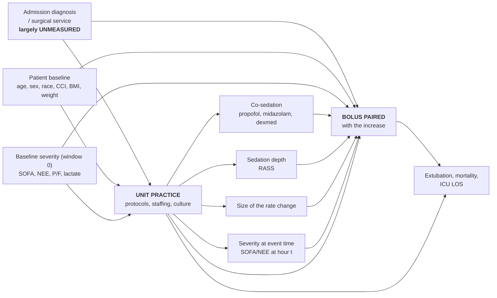

# Adjusting the unit comparison — design note

**Status:** proposal, nothing implemented · **Date:** 2026-09-30 · **Author:** Shan Guleria

What it would take to move from `06_unit_variation.R`'s **unadjusted** per-unit
rates to a **case-mix adjusted** comparison. Written because the adjusted
analysis was deferred (`covariates.json` → `unit_variation._STATUS_model`) and
the decision should be re-entered with the reasoning visible rather than
re-derived.

---

## 1. The estimand does not change

**Among fentanyl infusion increases, the fraction accompanied by a bolus within
±30 min.** Currently 13.4% pooled, ranging 5.3% (`surgical_icu`) to 21.9%
(`medical_icu`) across 6 ICU types
<!-- src: output/final_no_phi/06_unit_variation/unit_adherence.csv, unit_key=location_type, series="any increase" -->.

What changes is the **contrast**. Unadjusted compares units as they are.
Adjusted asks a counterfactual: *if this unit had seen the cohort's average
patient, what would its rate have been?*

---

## 2. What the bootstrap already does, and what it cannot do

The shipped analysis has **two different constructions**, easily conflated,
and seeing how they differ is what makes the move to a model make sense.

| | Caterpillar interval | Funnel envelope |
|---|---|---|
| **How built** | bootstrap percentiles — 2.5th/97.5th of 2,000 resamples | closed form, `p0 ± z·√(p0(1−p0)/n)·√DEFF` |
| **Centred on** | the unit's **own** rate | the **pooled** rate |
| **Answers** | where would *this unit* wobble to? | where would *any* unit of this size land **if it were truly average**? |
| **Bootstrap's role** | the whole thing | one scalar — `√DEFF` = 1.51 |

The funnel envelope is **not** a bootstrap. It is a null hypothesis drawn as a
shape, which is why it does not move when a unit's rate moves. The bootstrap
contributes only the clustering inflation factor; the 1/√n flare is analytic.

### The transition to a model

The bootstrap exists to solve **one** problem: events are not independent —
3.25 increases per episode, correlated within an episode — so a naive binomial
interval is too narrow. Resampling **episodes** rather than events fixes that
from *outside* the estimate, without any model.

A mixed model solves the identical problem from *inside*: `(1 | encounter_block)`
absorbs the same within-episode correlation as a parameter instead of a
resampling scheme. **So the episode random intercept in §5 replaces the
bootstrap; it does not sit alongside it.**

**But clustering was never the reason to model.** The bootstrap gets the
*uncertainty* right and leaves the *comparison* untouched: it still compares
units as they are, with whatever case mix they have. No amount of resampling
fixes confounding, because the problem is not the width of the interval — it is
what the point estimate is a comparison **of**.

> **The bootstrap makes the interval honest. Only a model makes the contrast
> honest.** That, and not the clustering, is the argument for §4 and §5.

---

## 3. Fixed vs random effects

|  | Fixed effect for unit | Random effect for unit |
|---|---|---|
| **Assumes** | nothing about units as a population | the unit intercepts are draws from N(0, τ²) |
| **Estimates** | one parameter per unit, from that unit's data | τ², then each unit as a compromise with the mean |
| **Shrinkage** | none | yes — thin units pulled toward average |
| **Gives an ICC** | no | yes (τ² / (τ² + π²/3) on the latent scale) |
| **Inference is to** | these units | the population units were drawn from |
| **Needs** | events per unit | **enough units** (conventionally 10–20+) |

### Why fixed, for unit, at a single site

1. **Six clusters.** τ² would be estimated from six numbers. Below ~10–20
   clusters it is imprecise, biased low, and can collapse to zero — so the ICC,
   which is the headline of the random-effects approach, is not reportable.
   Myers had 21 hospitals and 96 hospitals / 148 ICUs (PMID 39018285).
2. **Exogeneity is violated, which matters more than the count.** A random
   intercept assumes the cluster effect is *uncorrelated with the model's
   covariates*. Here it plainly is correlated — surgical patients are in the
   surgical ICU by definition. Under that violation the random intercept
   partly reattributes a real unit difference to case mix and shrinks units
   toward each other. Fixed effects are robust to it.
3. **Shrinkage buys nothing.** The smallest unit contributes 905 events
   <!-- src: unit_adherence.csv, burn_icu, series="any increase" -->; none is
   thin enough to need borrowing.

### Why random, for episode

7,408 episodes <!-- src: 06_unit_variation/attribution_funnel.csv row 1 -->,
3.25 increase events each, and no interest in any individual episode — only in
absorbing the correlation between events inside one. That is exactly the job a
random intercept is for, and the cluster count is ample. Measured design effect
2.29 <!-- src: unit_adherence.csv, deff column -->, i.e. a naive binomial
interval is ~1.5× too narrow.

**So the model is genuinely mixed: unit FIXED, episode RANDOM.** They differ
because the two levels are being asked different questions.

---

## 4. The DAG

The exposure is not "unit" as a location. It is **unit practice** — protocols,
staffing, culture. Everything that *is* that practice must stay out of the
model; adjusting for it removes the effect being measured.



### The adjustment set

| Variable | Role | Adjust? | Why |
|---|---|---|---|
| `age`, `sex`, `race`, `cci`, `bmi_admission`, `weight_kg` | confounder | **yes** | upstream of both unit assignment and dosing |
| Baseline severity at **window 0** — `sofa_total`, `nee`, `pf_ratio`, `lactate` | confounder | **yes** | present before the unit could act |
| Admission diagnosis / surgical service | confounder | **yes, if obtainable** | the strongest one, and the reason unit assignment is not random |
| Severity at **event time** (hour t) | part confounder, part mediator | **no** | at hour 40 it partly reflects 40 h of this unit's management |
| `propofol_dose`, `midazolam_dose`, `dexmedetomidine_dose` | mediator | **no** | co-sedation strategy *is* unit practice |
| `rass` | mediator | **no** | sedation depth is a result of how the unit dosed |
| `nvps` | ambiguous | **no, but report** | a pain score is both an indication for a bolus and a consequence of prior analgesia |
| Size of the rate change (`delta`) | mediator | **no by default** | how big a step to take is itself a unit decision |
| `kind` (initiation vs uptitration) | mediator | **stratify, don't adjust** | already handled — the caterpillar reports all three series |
| Hours since intubation | confounder-ish | **yes** | mostly the natural course rather than a unit choice |
| Extubation, mortality, ICU LOS | **collider / descendant** | **never** | downstream of both unit and outcome |

**Two calls worth stating out loud.**

- **Baseline severity, not event-time severity.** The same variable is a
  confounder at hour 0 and a mediator at hour 40. Use window 0.
- **Adjusting for `delta` answers a different question.** It becomes "given the
  same size of increase, does this unit pair a bolus?" — narrower and
  legitimate, but a *different estimand*. If run, run it as a named secondary
  analysis, never as the primary.

**Nurse:patient ratio, protocol presence, pharmacist cover** are not
confounders — they *are* the exposure. Adjusting for them would be adjusting
away the thing being measured.

---

## 5. The model

```r
glmer(paired ~ location_type          # 6 fixed parameters, the contrast of interest
              + age + sex + race + cci + bmi_admission + weight_kg
              + sofa_total_w0 + nee_w0 + pf_ratio_w0 + lactate_w0
              + window_start_hr
              + (1 | encounter_block),   # absorbs clustering of events in episodes
      family = binomial, data = events)
```

Report as **adjusted predicted rates per unit** — predict each unit with
covariates set to the whole-cohort distribution — so the output stays on the
percentage scale the estimand is defined on, directly comparable to today's
13.4%. Odds ratios are the model's native output but are not the estimand.

---

## 6. Gaps to close before fitting

1. **Admission diagnosis is not in `trajectory_long`.** The strongest confounder
   — why this patient is in this unit — is currently absent. `hospital_diagnosis`
   is read but collapsed to `cci`, and `hospitalization.admission_type_category`
   is not carried. **Fitting without it leaves the main confounding path open**,
   and that should be stated as the analysis's principal limitation whether or
   not it is fixed.
2. **`delta` is not in the handoff.** `titration_events_classified.parquet`
   carries `encounter_block, t_hr, kind, paired, on_hour` only. Needed for the
   secondary analysis in §4; a two-line change to `05_titration.R`.
3. **Baseline-severity columns must be built.** The covariates exist per window;
   the window-0 values need attaching to each event as episode-level constants.
4. **Prior opioid use / tolerance** — Myers adjusted for it; not derivable here
   without a pre-admission medication source.

---

## 7. Cost

`lme4` plus `minqa`, `nloptr`, `RcppEigen`, `boot`, `MASS` into a deliberately
pinned `renv.lock`, one of them compiled and heavy, restored at every site.
The dependency-free alternative is `glm()` with cluster-robust standard errors
by `encounter_block` — a reasonable approximation to the episode random
intercept, and worth taking if the pin is the binding constraint.

---

## 8. When Myers' design becomes the right one

Not at one site. `location_type` is mCIDE-controlled and poolable by
construction, so a consortium run — say 20 sites × 6 ICU types — reaches the
cluster count where a random intercept and a reportable ICC work. It also makes
the better question askable: **is it the kind of ICU, or the institution?**
That is a two-level model (unit type within site) and neither current view can
answer it.
